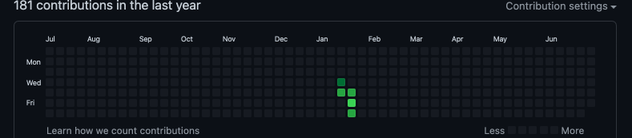

# GitHub Activity Animator
This project contains a simple Javascript snippet that produces an animation on your GitHub activity tracker.

The project also contains simple scripts that completes the pipeline from video files to GitHub activity.

## User Guide
### Conversion of video to frames

Usage: `python extract_frames.py "VIDEO_FILE.mp4"`

The above script will create a folder `video_frames`, and dump all the image frames from the video file into it.

### Conversion of frames to array

Usage: `python dump_data.py`

The above script will search the `video_frames` array and dump the formatted (Javascript) array string to standard output.

Example output can be seen in `frame_data`.

Users are advised to redirect the output to their clipboard utility, as per below.

MacOS: `python dump_data.py | pbcopy`

Linux: `python dump_data.py | xclip`

### Injection of Javascript into browser

1. Navigate to your desired GitHub profile
2. Open the browser console
3. Type `videoArr =` followed by the array string obtained by the dump. Complete declaration of the variable.
NOTE: This step is likely to freeze the browser for a while if the array is large.
4. Insert the script in `github_activity_animator.js` into the console.
Tweak the `FPS` in the script if need be.
5. Enjoy

## Attributions

Inspired by projects that makes pixel arts using GitHub's activity tracker, such as [gitfiti](https://github.com/gelstudios/gitfiti).

Further inspired by [Junferno's Bad Apple on everything](https://www.youtube.com/playlist?list=PLsTVaNk5lQHmRy51gyAsVN16DHpv0gcfE).
